# Data Engineering in Azure, Lab 1

The purpose of this lab is to show how to ingest batch data ad-hoc in Azure in an automated event-based way.

The lab requires no coding but you are encouraged to look at the code to get an understanding of what is happening "under the hood". After you have created a cloud setup using Azure CLI and Bicep, you will test the cloud setup by uploading two CSV files one after another (see [`sample-data/`](./sample-data)) and watch the data be ingested into Azure SQL Database.

## Scenario
Taxi company HAPPY TAXI is moving their legacy data analytics solution into Microsoft Azure cloud.

The solution is based on processing incoming CSV files with taxi rides data that HAPPY TAXI's analysts were extracting and uploading the files to the legacy solution manually during early morning hours. The migration to the cloud is expected to ease up the workload of the analysts by removing the need to perform the ingestions manually, saving a huge amount of man-hours.

A consultancy company has been tasked to present a prototype of the automatic data ingestion pipeline that is able to react on incoming CSV files that arrive to a designated storage in Azure under unspecified time intervals (the creation of the files themselves is not within the prototype's scope). They've been provided with a set of CSV files containing a fragment of used data.

During the implementation of the prototype it has been found that the received timestamp field format `YYYY-MM-dd HH:mm:ss UTC` does not conform with allowed timestamp field format so an extra transformation needed to be added.

## Prerequisites
* [Visual Studio Code](https://code.visualstudio.com/) and optional Extensions (install from VS Code):
    * Bicep
    * SQL Server (mssql)
* [Azure CLI](https://docs.microsoft.com/sv-se/cli/azure/install-azure-cli#install)
* [git](https://git-scm.com/)
* [jq](https://stedolan.github.io/jq/download/)
    * Special note for Win: it is recommended to follow the advice to use Chocolatey
* [SqlPackage](https://learn.microsoft.com/en-us/sql/tools/sqlpackage/sqlpackage-download?view=sql-server-ver16)
    * Special note for Win: add `C:\Program Files\Microsoft SQL Server\160\DAC\bin` to user Environment Variable `Path`
* an Azure Resource Group
    * **Tech Evolution:** a trainer must create the group beforehand and share the name of it with the trainees
    * **Self-paced:** create the group from Azure portal and use its name for the lab. You must be assigned to a subscription (Forefront's or your own) to do that

### Windows

1. Start a cmd terminal as administrator

1. Install the prerequisites using winget by executing the following commands

    ```cmd
    winget install -e --id Microsoft.VisualStudioCode
    winget install -e --id Microsoft.AzureCLI
    winget install --id Git.Git -e --source winget
    ```

1. install [SqlPackage](https://learn.microsoft.com/en-us/sql/tools/sqlpackage/sqlpackage-download?view=sql-server-ver16)

    ```cmd
    curl -SsLo SqlPackage.msi https://go.microsoft.com/fwlink/?linkid=2209512
    SqlPackage.msi /qr
    powershell -Command "[Environment]::SetEnvironmentVariable('Path', [Environment]::GetEnvironmentVariable('Path', 'User') + ';C:\Program Files\Microsoft SQL Server\160\DAC\bin', 'User')"
    ```

1. Install [jq](https://stedolan.github.io/jq/download/)

    ```cmd
    curl -SsLo jq.exe https://github.com/stedolan/jq/releases/download/jq-1.6/jq-win64.exe
    move jq.exe "C:\Program Files\Git\cmd"
    ```

1. Open a new visual studio code and start a git bash terminal

### Macos

1. Install homebrew
    ```sh
    /bin/bash -c "$(curl -fsSL https://raw.githubusercontent.com/Homebrew/install/HEAD/install.sh)"
    ```

1. Install brew dependencies
    ```sh
    brew install visual-studio-code  azure-cli git jq
    ```

1. Install SqlPackage

    ```sh
    mkdir -p sqlpackage
    curl -SsLo sqlpackage-osx.zip  https://go.microsoft.com/fwlink/?linkid=2209610
    unzip sqlpackage-osx.zip -d sqlpackage
    chmod +x sqlpackage/sqlpackage
    export PATH="$PATH:${PWD}/sqlpackage"
    sqlpackage
    ```

## Directory structure
* [`modules/`](./modules) - Bicep modules used in this lab to deploy necessary resources in Azure
* [`projects/`](./projects) - storage of projects used in this lab. Contains a single MS SQL Database project `lab_db` with a single table [`dbo.taxi_rides`](./projects/lab_db/tables/taxi_rides.sql)
* [`sample-data/`](./sample-data) - Sample CSV files used in this lab
* [`0_deploy.sh`](./0_deploy.sh) - Main deployment script of this lab
* [`1_deploy_storage.bicep`](./1_deploy_storage.bicep) - Bicep module used by the deployment script
* [`2_deploy_process.bicep`](./2_deploy_process.bicep) - Bicep module used by the deployment script

## Instructions
### Check the access to Azure
1. Login via `portal.azure.com`
2. **(For Tech Evolution)** Check your account information at the top-right corner of the Azure main panel. Right below of your email address the Azure subscription should be set to `FOREFRONT CONSULTING LAB`
3. In a search bar at the top on Azure main panel type `Resource groups` and hit the matching icon
4. From the list of resulting recource groups, find the one created by a Tech Evolution trainer or your own group. Use the name of the group in the main deployment script (see the next section)

### Deploy the solution
1. Go to the main deployment script at  [`0_deploy.sh`](./0_deploy.sh) and replace the values of the following input parameters:
    * `RESOURCE_GROUP_NAME` - replace with the name of the group used for the lab
    * `PREFIX` - replace with your name or your initials. The prefix will be used for easier grouping of your resources within the Azure Resource Group
    * `LOCAL_IP_ADDRESS` - replace with the external IP address of your machine
2. Execute the script:
    * For Mac:
    * For Win:
        * Open Command Prompt (cmd.exe) or Terminal in VS Code
        * Navigate to the lab directory `ffcg-labs/azure-bicep-labs/01-adf-file-ingest` via `cd` command
        * Run `bash -c "./0_deploy.sh"`
    
    The script will ask to login to Azure via a pop-up browser window. Do so and track the progress of the deployment that would take around 3-5 minutes.

### Work with Azure
1. Go to the resource groups via [portal.azure.com](https://portal.azure.com). The resource groups can be offered at the main panel. If not, type either `resource group` or the exact name of the group required in the search bar at the top

    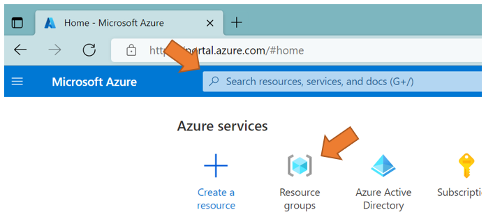

    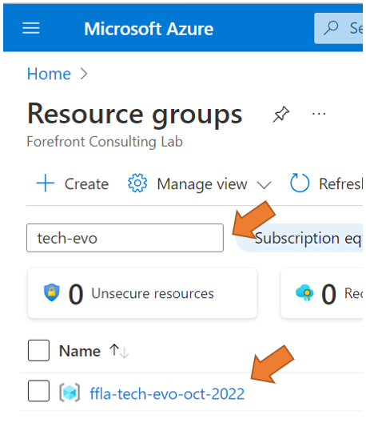

2. Search for the resources created in the group. Use `PREFIX` in the search bar to list the relevant matches. The matches should consists of:
    * Storage Account 
    * Azure Data Factory
    * Azure SQL Server logical instance
    * Azure SQL Database
3. Go to your created Storage Account
    * Go to either `Blob Storage` or `Data Storage | Containers` to access the containers

        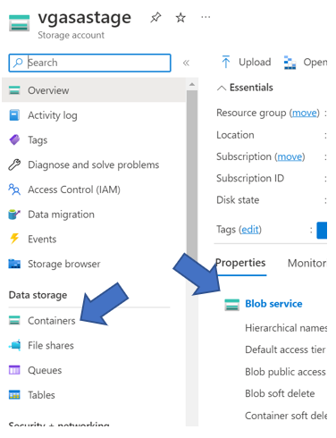
    * You should see a container called `ingest`. Access it
    * Observe the container. You would find a button Import on the top ribbon to the left. Clicking on the button will open up a new window slide to the right. Use it later in the lab to upload the sample data.

        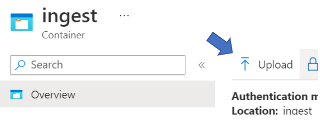
4. Go to your Azure SQL Database
    * Observe the tool ribbon to the left at the main Azure SQL Database panel. Notice `Query Editor (preview)`. This will be a tool for querying the database during this lab.

        Note: there are other tools to query Azure SQL Database so feel free to use them if it's your preferrence.

        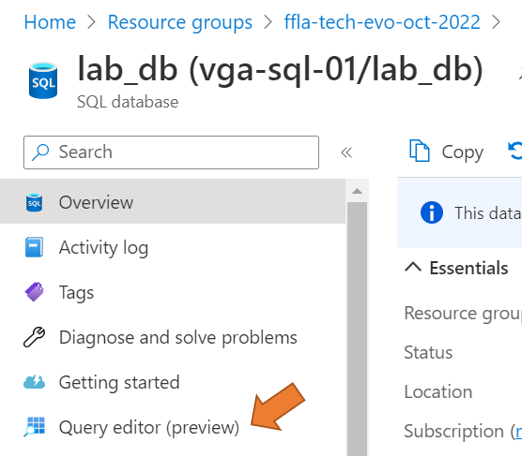
    
    * The Query Editor will offer authenticating into the database via either username-password combination or via your Azure @forefront.se identity. Use the username and password from [0_deploy.sh](./0_deploy.sh), lines 12-13

        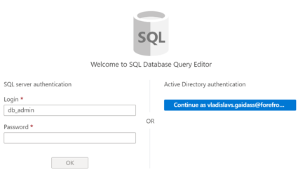
    
    * Once you've authorized, you can see the list of database objects present inside the database. For this lab, the database project consists of a sole table called `[dbo].[taxi_rides]`. You may try out querying the table via
        ```sql
            SELECT *
            FROM [dbo].[taxi_rides]
        ```

        At this point, the query will return 0 results.

        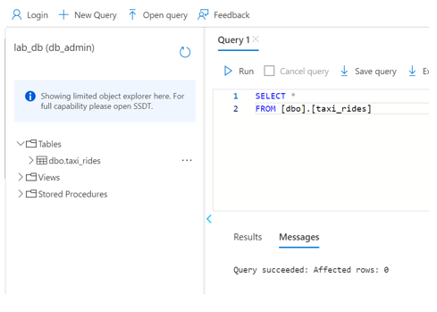
5. Go to your Azure Data Factory instance
    * Data Factory has its own portal which accessible via `Launch studio` button located in the middle of the main Data Factory panel in Azure

        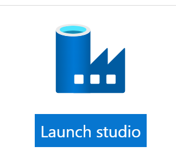

    * When entering the home page of Data Factory Studio, notice the side ribbon to the left. It contain 3 main panels of Data Factory:
        * **Manage** - to manage connections to other services, virtual machines (called 'integration runtimes'), Git configuration and pipeline scheduling via triggers 
        * **Author** - for developing pipeline components
        * **Monitor** - to track executions of pipelines and triggers

        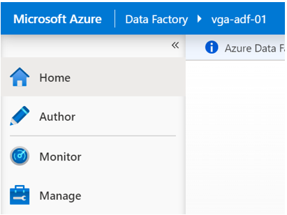

        Feel free to navigate through all panels.

    * Go to Author panel. There, the panel is being split into components groups.
    
        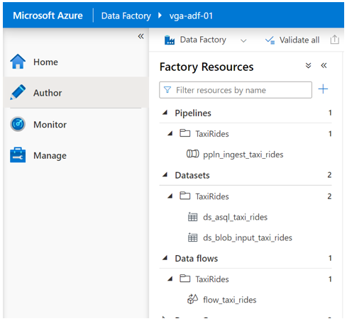

        In this lab we're interested in:
        * Pipelines - the main collection of operations done by Data Factory. Consists of Activities calling Datasets and/or Data Flows. In this lab, the pipeline consits of one Data Flow activity calling `flow_taxi_rides`
        * Datasets - abstractions of data stores in a designated data source. Datasets can point to files, tables or other data endpoints
        * Data flows - a newer version of creating data transformations. The transformations are being chained together in the UI by using predefined actions like changing field type of filtering out some field values.
        
            The main difference between Data Flow and ordinary Data Factory activities is that Data Flow can apply transformation per record while normal activities work on the entire batch. 
        

        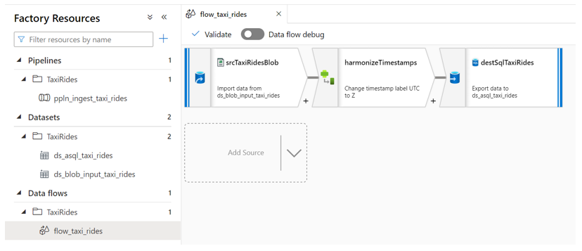

        **EXTRA**: why Data Flow needs to change the format of the timestamp by replace `' UTC'` with `'Z'`? Try to execute the following SQL query in Azure SQL Database Query Editor first with UTC and then with Z at the end:
        ```sql
            SELECT
                CONVERT(DATETIME2, '2014-09-16 21:30:00.000000 UTC') AS [datetime2],
                CONVERT(DATETIMEOFFSET, '2014-09-16 21:30:00.000000 UTC') AS [datetimeoffset]
        ```
    * Go to Manage panel
        * Go to `Connections | Linked Services`. The panel would list two existing linked services: one for blob storage, another for Azure SQL database
        * Every linked service has been pre-configured by the Bicep configuration that has been used during the deployment.
        
            Please confirm the connectivity of the services by clicking on each linked service (which would open another panel to the right), scrolling through the new panel until `Test connection` button at the bottom. The result should give the green light.

            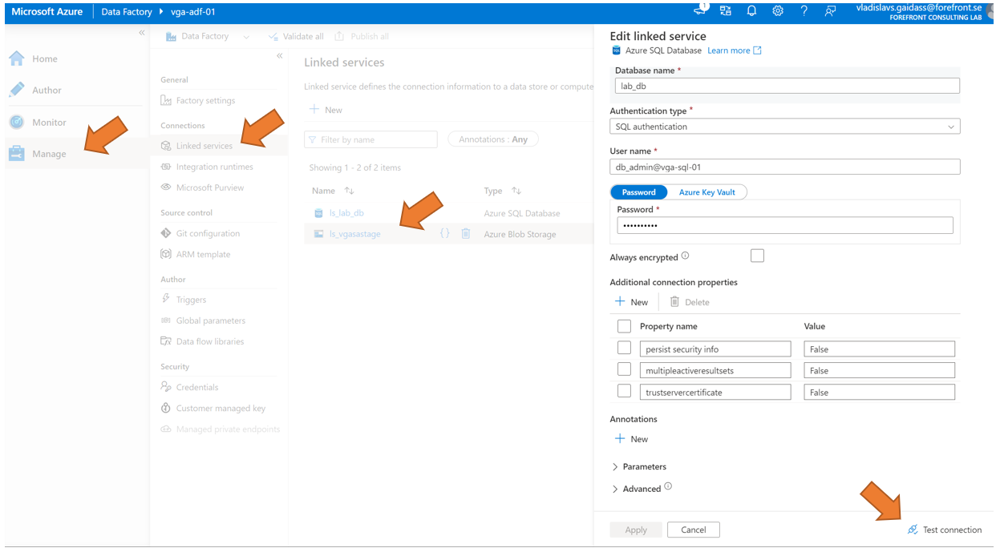
        * Without leaving the Manage panel, go to `Author | Triggers`. The panel would list one trigger that should be activated. Please confirm that the Status is green.

            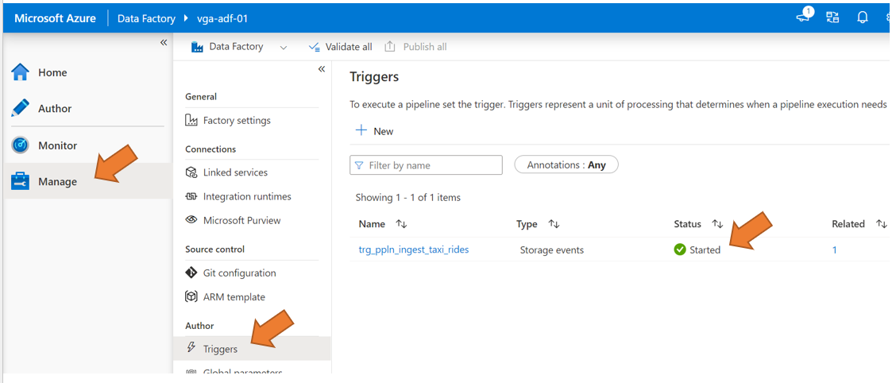

    * Go to Monitor panel. Notice the panels at `Runs | Pipeline runs` and `Runs | Trigger runs. Have them open and proceed.

### Ingest 2014 data
1. Go to your created Storage Account, container `ingest`
2. Click on Upload file and search for `01-adf-file-ingest\sample-data\chicago_taxi_trips_2014.csv` on your local machine
3. Confirm that the file got uploaded to the container
4. Go back to Azure Data Factory and check `Monitor | Runs | Trigger runs`. There should be one entry created. Check `Runs | Pipeline runs` which should also have a new entry. The pipeline requires ca 3-5 minutes to start the integration runtime (VM) to be able to run the Data Flow. Please wait till the run is green.

    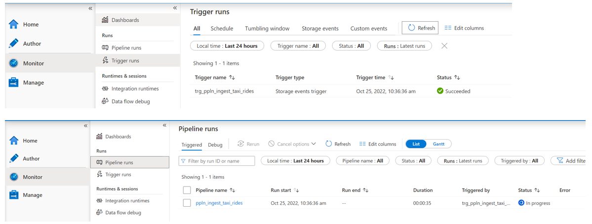

5. Go back to Azure SQL Database. Confirm the presence of 2014 data by running
    ```sql
        SELECT YEAR(trip_start_timestamp) AS year, COUNT(*) AS count
        FROM [dbo].[taxi_rides]
        GROUP BY YEAR(trip_start_timestamp)
    ``` 

    There should be 1000 entries present.

### Ingest 2015 data
1. Do steps 1-4 from the previous section. A new execution runs would be present in Data Factory Monitor panel
2. Confirm that 2015 data has been uploaded. There should be 2000 entries present (1000 per each year).

### Querying data
Scenario: The data analysts working on the prototype wish to create visualizations based on taxi trip duration. Unfortunately, they've found that some entries contain `trip_seconds = NULL`. At the same time, fields `trip_start_timestamp` and `trip_end_timestamp` have no NULL so the data engineer has presented a way to correct the data.

Task: finish the query at ISNULL
```sql
SELECT
	unique_key,
	taxi_id,
	trip_start_timestamp,
	trip_end_timestamp,
	ISNULL(trip_seconds, ...) AS trip_seconds
FROM [dbo].[taxi_rides]
-- To show only the affected records
-- WHERE trip_seconds IS NULL
```

Scenario 2: The data analysts continue evaluating there data, this time with comparing total sum of total taxi fare (`trip_total`) paid by different methods (`payment_type`) on yearly basis

Task: finish the query
```sql
SELECT
	YEAR(trip_start_timestamp) AS year,
    ...,
    ... AS sum
FROM [dbo].[taxi_rides]
GROUP BY
    YEAR(trip_start_timestamp),
    ...
```

Questions:
* How many types were there?
* What is the one with the highest sum?