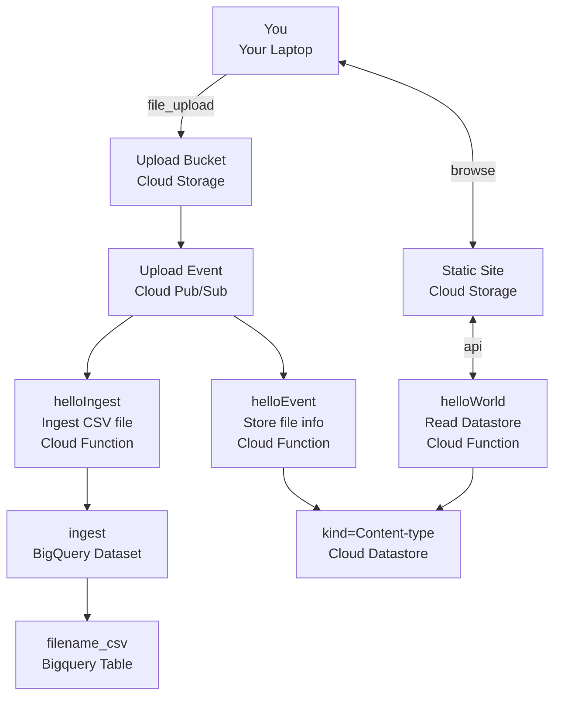

# GCP source code

Folders in this directoy includes different examples of code running on resources in Google Cloud Platform.

* [helloEvent](./helloIngest/README.md) Writes metadata to a cloud datastore database when files are uploaded to a storage bucket
* [helloWorld](./helloWorld/README.md) Deploys a static site and cloud functions-api that lists files previously uploaded in `helloEvent`
* [helloIngest](./helloIngest/README.md) Ingests CSV file to Bigquery when CSV files are uploaded to a storage bucket

## GCP Solution Overview

The following solution will be deployed when performing this lab or running terraform:

