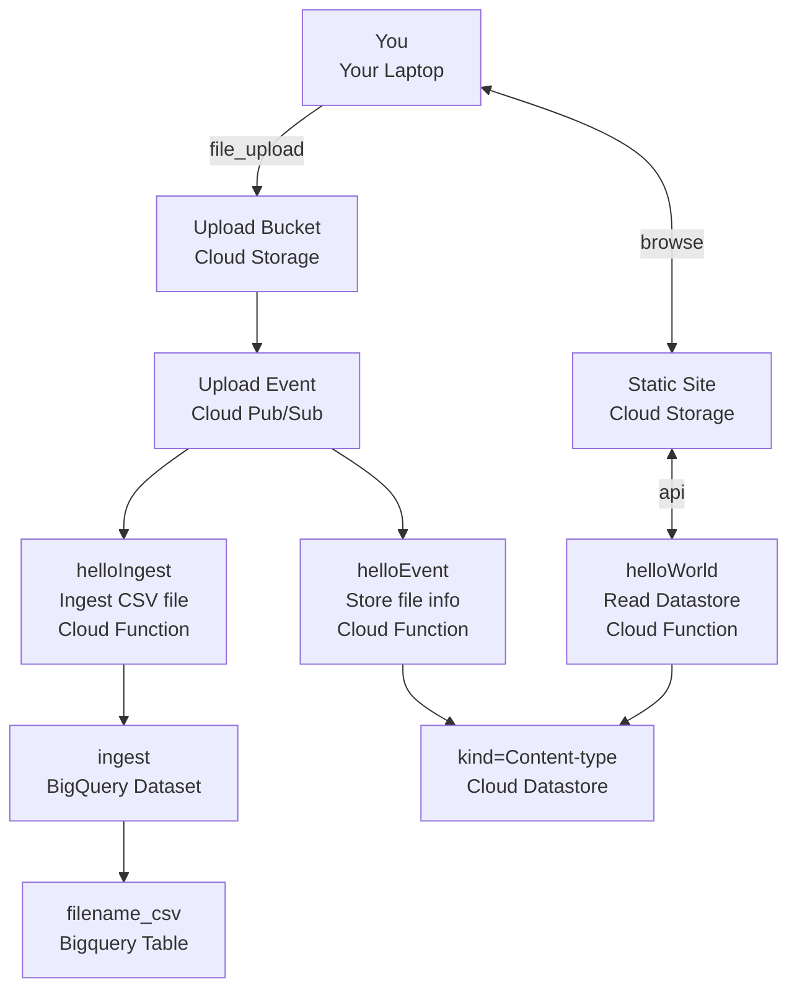

# Terraform GCP

Deploys a serverless example that deploys the following:

Files uploaded to Cloud Storage generate Pub/Sub events that stores metadata about the uploaded image to Cloud Datastore.
A website hosted in a Cloud Storage bucket queries a public API for file names stored in Cloud Datastore:



<!-- You can choose to run these scripts either in the terminal of your workstation or in the GCP command line interface.-->

## Prerequisites

### Installed locally
* Terraform 1.0.x
* gcloud sdk

**or** 

use the Coogle Cloud shell <https://console.cloud.google.com/home/dashboard?project=serverless-labs-328806&cloudshell=true>

## Usage

1. Create default credentials. These are used by terraform for authentication:

    ```terminal
    gcloud auth application-default login
    ```

    **or**

    Create an access token that is valid for 1 hour and only in the terminal that you execute the command in. If both options are used, this takes preceedence.

    ```sh
    export GOOGLE_OAUTH_ACCESS_TOKEN=$(gcloud auth print-access-token)
    ```

1. Initialize terraform

    Change directory to /serverless-lab/terraform/gcp if you have not already

    ```terminal
    cd ./terraform/gcp
    ```

    Select a unique prefix YOUR-PREFIX, e.g. `john-doe` using only lowercase alpha characters, or you'll have a collision with other lab atendees and redeploy each other's resources:

    ```terminal
    terraform init -upgrade -backend-config="prefix=<YOUR-PREFIX>"
    ```

    **Example:**

    ```terminal
    terraform init -upgrade -backend-config="prefix=jonasahnstedt"
    ```

1. Deploy Changes

    Run terraform. When queried for a unique prefix, use the same prefix as above.

    ```terminal
    terraform apply
    ```


    ```output
    var.prefix
    The initials or similar of the student for the lab, e.g. jonasahnstedt for John Anderson. Will be used to prefix resources.

    Enter a value: <YOUR-PREFIX>
    ```

    **Example:**

    ```terminal
    Enter a value: jonasahnstedt
    ```

    You can also add the prefix as an argument to terraform commands:

    ```sh
    terraform apply -var prefix=<your prefix>
    ```

1. Confirm

    You can evaluate the output to see what has been changed or added, if you want but that's for a different competence track

    ```sh
    Enter a value: yes
    ```

    ```output
    Outputs:

    https_trigger_url = "https://europe-west1-serverless-labs-328806.cloudfunctions.net/YOUR-PREFIX-hello-world"
    public_url = "https://storage.googleapis.com/YOUR-PREFIX-serverless-labs-328806-static-site/index.html"
    ```

1. Modify the [../../public/index.html](../../public/index.html) page to use the new https_trigger_url

    ```html
    const apiUrl =
        "https://europe-west1-serverless-labs-328806.cloudfunctions.net/YOUR-PREFIX-hello-world";

    ```

1. Redeploy, don't forget to reapply your prefix:

    ```sh
    terraform apply -var prefix=<your prefix>
    ```

    This will compare your backend state with your terraform code and add, modify or remove anything that is not up to date, including:

    * Changing the contents of the `public` folder (did you remember to change the `apiUrl`)
    * Changing any of the `functions src`
    * updating any `terraform` resources

1. Return to the [lab instructions](../../LAB.md)

